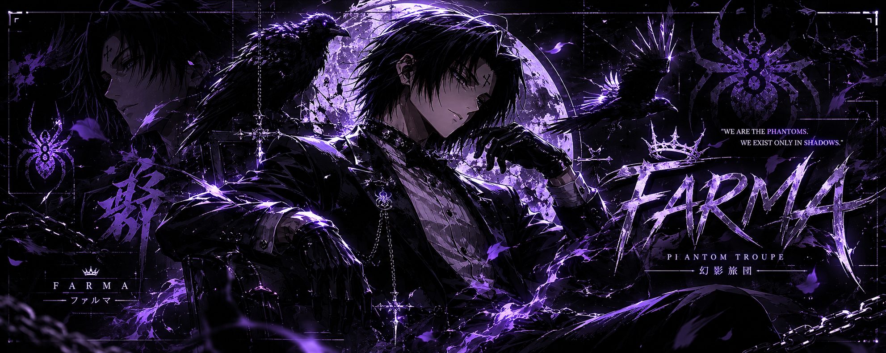

  

---

##  Hey, I'm Farma

I'm a developer who builds tools that make Windows run better — and Discord bots that keep servers alive and automated.

I'm currently working on **[boostUP](https://myboostup.netlify.app)**, a PC optimizer that boosts FPS, lowers ping, and keeps your system clean.

---

##  What I work with

<table align="center">
  <tr>
    <td align="center" width="96">
       
      <b>TypeScript</b> 
      Bots · Backends
    </td>
    <td align="center" width="96">
       
      <b>JavaScript</b> 
      Bots · Web
    </td>
    <td align="center" width="96">
       
      <b>Rust</b> 
      Tooling
    </td>
    <td align="center" width="96">
       
      <b>HTML</b> 
      Structure
    </td>
    <td align="center" width="96">
       
      <b>CSS</b> 
      Design
    </td>
  </tr>
</table>

   System tools ·  Desktop apps ·  Websites ·  Dashboard

---

##  Tools I use

<table align="center">
  <tr>
    <td align="center" width="96">
       
      <b>VS Code</b> 
      Editor
    </td>
    <td align="center" width="96">
       
      <b>Git</b> 
      Versioning
    </td>
    <td align="center" width="96">
       
      <b>GitHub</b> 
      Hosting
    </td>
    <td align="center" width="96">
       
      <b>Node.js</b> 
      Runtime
    </td>
    <td align="center" width="96">
       
      <b>Windows</b> 
      OS
    </td>
  </tr>
  <tr>
    <td align="center" width="96">
       
      <b>npm</b> 
      Packages
    </td>
    <td align="center" width="96">
       
      <b>Discord</b> 
      Dev Portal
    </td>
    <td align="center" width="96">
       
      <b>Netlify</b> 
      Deploy
    </td>
    <td align="center" width="96">
       
      <b>PowerShell</b> 
      Scripting
    </td>
    <td align="center" width="96">
       
      <b>Markdown</b> 
      Docs
    </td>
  </tr>
  <tr>
    <td align="center" width="96">
       
      <b>Docker</b> 
      Containers
    </td>
    <td align="center" width="96">
       
      <b>Tauri</b> 
      Desktop
    </td>
    <td align="center" width="96">
       
      <b>React</b> 
      UI
    </td>
    <td align="center" width="96">
       
      <b>Vite</b> 
      Build
    </td>
    <td align="center" width="96">
       
      <b>Tailwind</b> 
      CSS
    </td>
  </tr>
  <tr>
    <td align="center" width="96">
       
      <b>Supabase</b> 
      Backend
    </td>
    <td align="center" width="96">
       
      <b>pnpm</b> 
      Packages
    </td>
    <td align="center" width="96">
       
      <b>Rust</b> 
      Backend
    </td>
    <td align="center" width="96">
       
      <b>Neovim</b> 
      Editor
    </td>
  </tr>
</table>

---

##  Current project

  

**boostUP** — Desktop-grade PC optimization for gamers.

> ⏳ Coming soon. Follow the progress on the [website](https://myboostup.netlify.app).

---

##  Now playing

  🎧 Open to music while I build — or find me on <a href="https://discord.com/users/1388316334521319536">Discord</a>

---

##  Let's connect

  
  &nbsp;
  
  &nbsp;
  

  <a href="https://myboostup.netlify.app">Website</a> · <a href="https://discord.com/users/1388316334521319536">Discord</a> · <a href="mailto:farma3334@gmail.com">Email</a>

---

  Built with  Rust +  TypeScript & a lot of coffee

