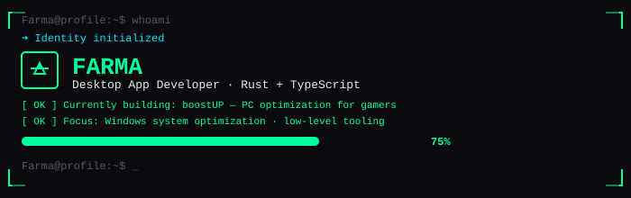

  

---

## 👋 Hey, I'm Farma

I'm a desktop app developer who builds tools that make Windows run better — especially for gamers.

I'm currently working on **[boostUP](https://myboostup.netlify.app)**, a PC optimizer that boosts FPS, lowers ping, and keeps your system clean.

---

## 🛠️ What I work with

| Stack | For |
|:------|:----|
| 🦀 **Rust** | High-performance desktop backends |
| ⚛️ **TypeScript + React** | Fast, reactive UIs |
| 🖼️ **Tauri** | Lightweight desktop apps |
| ⚙️ **Windows** | System optimization & low-level tooling |

---

## 🎯 Current project

  

**boostUP** — Desktop-grade PC optimization for gamers.

> ⏳ Coming soon. Follow the progress on the [website](https://myboostup.netlify.app).

---

## 📫 Let's connect

- 🌐 **Website:** [myboostup.netlify.app](https://myboostup.netlify.app)
- 📧 **Email:** _coming soon_

---

  Built with ❤️ and lots of coffee · 🦀 Rust + TypeScript

